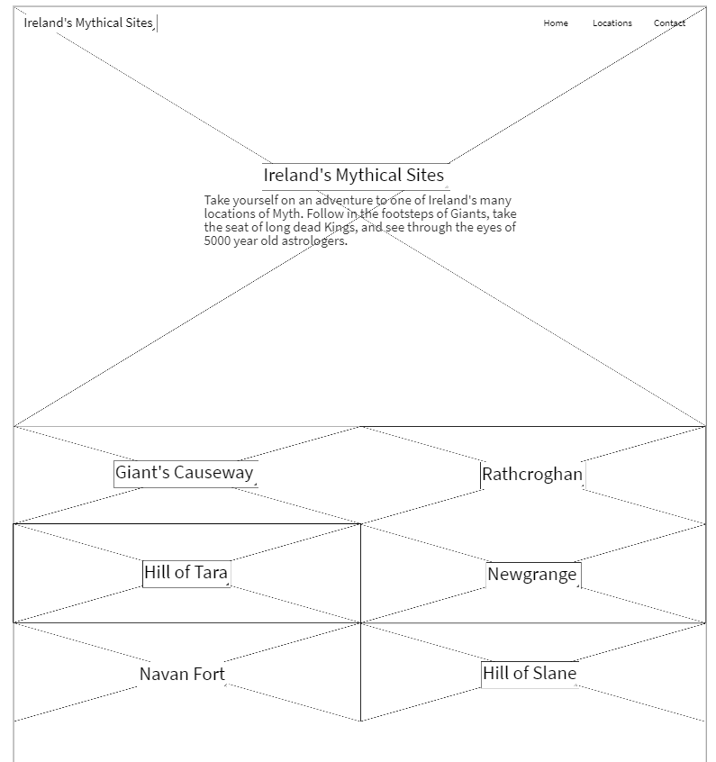
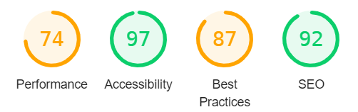
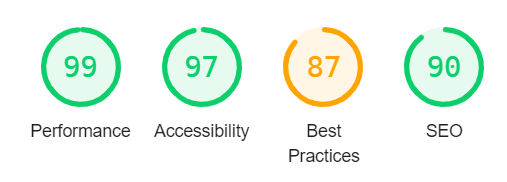

<h1 align="center">Ireland's Mythical Sites</h1>

## About

Project - Interactive Frontend Development - Code Institute

The purpose of this project is to provide a website for people wanting to travel to the different Mythical Sites of Ireland.

It will serve to provide background information on each mythical location as well as to help the user locate each attraction via the use of a google maps API.

## Deployment

A link to the website can be found [#]

## Table of Contents

[User Experience (UX)](#UX)

[Features](#features)

[Technologies Used](#technologies)

[Testing](#testing)

[Deployment](#deployment)

[Known Bugs](#bugs)

[Credits](#credits)

## User Experience (UX)

The end user of this project will be fans of the mythical and historical ethos of Ireland.

It is aimed at people wanting to travel all over Ireland to visit it's oldest and strangest landsites, while learning something of the locations back-stories along with the journey.

### User Stories

* As a user I want to be shown a visual glimpse of the location.
* As a user I want to be able to find out background and historical information on each attraction.
* As a user I want to be shown where each attraction can be found on google maps.
* As a user I want to be to follow the website through social media to easily keep up to date on any new attractions added or functions added to the website.
* As a user I want to be able to navigate the site easily whether accessing through my mobile or laptop.
* As a user I want to be able to get in touch to ask questions about the attractions and their surrounding areas.

### Design

- ####    Colour Scheme
    - The colours used for the website were chosen for the colours of the Irish flag. Colours of Green, White and Orange. The colours will hopefully put the users of the site in the mood to become immersed in all things Irish, whether that be foreign tourists or Irish people looking to discover more about their roots.

    

- ####    Typography
    - The main font I have chosen is 'Oswald' as it is easy to read and stands out. I will use sans-serif as a backup font.

    - The secondary font used is 'Quattrocento' to help headings and titles to stand out from the rest of the text and to give the headings a scriptive look.

- ####    Images
    - The main use of images for this website will be the ones used to depict the locations. (https://unsplash.com)

    - For the hero-image I have chosen the image of a castle atop an overgrown hill in the foreground, with the open sea taking up the background. This will hopefully ignite in the user a feeling of openess and adventure.

    - Other images constist of small icon images taken from (https://fontawesome.com/v4.7/) to represent the social media links.

- ####    Wireframes
    - All wireframes were made using MockFlow.com. I have left up my original wireframes to show how the project changed shape as I worked through it.

        

## Features

### Common Features

* Header - provides users with easy navigation throughout the webpage.
    - The navigation menu is positioned in the header because this is the most common location for it meaning the user will know exactly where to find it.
    - I chose to leave the header blended ontop of the hero-image to make the hero-image priority when it comes to attracting the user's eye when first accessing the website.
* Links/Buttons - Any links hovered over will respond.
    - The page navigation links in the header and images will change colour to an orange colour (#E39105) and will grow in size using the hvr-grow class found at https://designlink.work/hover-css/
    - The social media images will also change an orange colour (#E39105) when hovered over.
* Hero-image
    - For the hero-image I have chosen the image of a castle atop an overgrown hill in the foreground, with the open sea taking up the background. This will hopefully ignite in the user a feeling of openess and adventure.
* Map
    - The map feature indicates where each mythical location is within Ireland, with the locations name appearing when its marker is hovered over.
* Contact
    - The contact page provides a simples to use and understand form requesting basic information from any users who wish to get into contact with the Author.
* Footer
    - The footer has been designed to look a bit plainer when compared to the rest of the webpage as I want the rest of the page to stand out.
    - The social media links take center stage of the footer to encourage the user to follow any changes to the site on social media.

### Prospective Features
-   I would like to make the map more interactive by being able to click on the images to zoom into their exact location on the map.
-   I would also look to add more locations and also other interesting sights and activities around the main locations.

### Languages Used

    - HTML5
    - CSS3
    - JavaScript

### Frameworks, Libraries & Programs Used

* [Bootstrap v4.6.0](https://getbootstrap.com/)
* [Font Awesome](https://fontawesome.com/) - Font Awesome was used to add social icons
* [Google Fonts](https://fonts.google.com/) - Google Fonts was used to import 'Quattrocento' and 'Oswald' fonts in the main.css stylesheet.
* [Git](https://git-scm.com/) - Git was used for version control by utilizing the Gitpod terminal to commit to Git and Push to GitHub.
* [GitHub:](https://github.com/) - GitHub is used to store the projects code after being pushed from Git.
* [GitPod](https://www.gitpod.io/) - GitPod, connected to GitHub, hosted the coding space and allowed the projected to be committed to the Github repository.
* [Mockflow](https://www.mockflow.com/) - Mockflow was used to create the [wireframes].
* [Paint 3D] - Microsoft app Paint 3D was used to edit some of the images for the book covers.
* [jquery v3.5.1](https://getbootstrap.com/) - retrieved from a bootstrap example to assist with my navigation toggler.
* [Chrome DevTools](https://developer.chrome.com/docs/devtools/) for constant debugging and checking of features.

## Testing

### Google Chrome DevTools
-   Much of my testing was done with dev tools on google chrome throughout the coding process - and fault finding on each specific screen size starting from the smallest screen first and working my way up to my largest screen.
-   During testing and the making of the site I regularly used the element.style box to test out different styling ideas before implementing them into the permanent code.
-   I ran both mobile and desktop through DevTools Lighthouse project:
    - Mobile
    

    - Desktop
    

### Functionality Testing
- #### Internal & External links
    - All links are working and have been tested on several screen sizes.
    - The hamburger menu appears on screen sizes smaller than 992px. When clicked, it expands to reveal page links. These have been tested and are working as expected on several screen sizes.
- #### Contact Form
    - The contact form has been tested on several screen sizes and is in working order.
    - Each input field makes use of the 'required' attribute and once each field is filled in the form successfully send.

## Deployment

### Publishing
This website was published using [GitHub Pages](https://pages.github.com/). The procedure is outlined below.
1. Go to the GitHub website and log in.
2. On the left-hand side, you'll see all your repositories, select the appropriate one. ([Repository](https://github.com/RuaOCuinn/MilestoneOne) used for this project).
3. Under the name of your chosen Repository you will see a ribbon of selections, click on 'Settings' located on the right hand side.
4. Scroll down and click on the 'Pages' tab on the left-hand side.
Under the 'Source' click on the dropdown and select 'master branch' and click save.
5. A link to your published page then appears above the source option.

## Credits

* [pexels](https://pexels.com/) - images for locations.
*([unsplash]https://unsplash.com/) - images for locations.
* [fontawesome](https://fontawesome.com/) - used for social media icons.
* [Mockflow](https://mockflow.com/) - used to create wireframes at the beginning of the project.

### Content

*   All content was written by the developer.

### Media
* Animated mock profile image of Oscar Pearson provided by (https://dribbble.com/Setya182)
* Parchment hero-image and book cover for Bloodstone: Book Two on the 'Books' page provided by pixabay.com at (https://www.pexels.com/@pixabay)
* Book cover for Bloodstone: Book Three on the main landing page is by (https://www.pexels.com/@pedro-figueras-202443)
* Book cover for Confused Worship on the 'Books' page provided by (https://www.pexels.com/@monatrms)

### Acknowledgements
* I would like to Acknowledge Maranatha Ilesanmi for all his advice and support through our mentor meetings